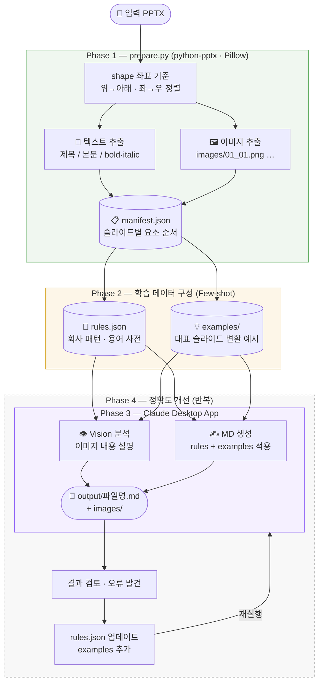

# PPTX → Markdown 변환기 개발 계획

---

## 아키텍처 & 흐름도



---

## 목표
PPTX 파일을 Markdown으로 변환. 이미지는 슬라이드 내 위치/순서를 보존하여 `images/` 하위 폴더에 저장, MD 내 상대경로로 참조.

## 실행 환경
- **Claude**: 데스크탑 앱 (API 키 없음, Claude Code 내에서 직접 실행)
- **Python**: python-pptx 기반 파싱 스크립트 (라이브러리 사용)
- **OS**: Windows 11 노트북

---

## 개발 단계

### Phase 1 — 파서 (prepare.py)
- [ ] PPTX 열기, 슬라이드 순회
- [ ] shape 좌표(left, top) 기준 위→아래, 좌→우 정렬
- [ ] 텍스트 shape → 내용 추출 (bold/italic 포함)
- [ ] 이미지 shape → PNG 저장 (`images/슬라이드번호_순번.png`)
- [ ] 슬라이드별 manifest JSON 생성

  ```json
  {
    "slide": 1,
    "elements": [
      { "type": "title", "text": "제목" },
      { "type": "text", "text": "본문 내용" },
      { "type": "image", "path": "images/01_01.png", "position": "center" }
    ]
  }
  ```

### Phase 2 — 학습 데이터 구성 (learn.py)
- [ ] 회사 PPTX 다수 분석
- [ ] 반복 레이아웃 패턴 추출 → `rules.json`
- [ ] 대표 슬라이드 변환 예시 수작업 작성 → `examples/` (Few-shot)

### Phase 3 — Claude 변환 (이 앱에서 실행)
- [ ] manifest + 이미지 파일을 Claude에 제공
- [ ] rules.json + examples/ Few-shot 포함한 프롬프트 구성
- [ ] 슬라이드별 MD 생성 → 하나의 파일로 병합
- [ ] 출력: `output/파일명.md` + `output/images/`

### Phase 4 — 정확도 개선 (반복)
- [ ] 변환 결과 검토
- [ ] 틀린 패턴 → rules.json 업데이트
- [ ] 새 Few-shot 예시 추가

---

## 출력 구조

```
output/
├── 파일명.md
└── images/
    ├── 01_01.png   ← 슬라이드1 첫번째 이미지
    ├── 01_02.png   ← 슬라이드1 두번째 이미지
    └── 02_01.png   ← 슬라이드2 첫번째 이미지
```

---

## 의존성

```
pip install python-pptx Pillow
```

외부 바이너리 없음 (LibreOffice 불필요)

---

## 미결 사항
- [ ] Python 버전 확인
- [ ] 테스트용 샘플 PPTX 준비
- [ ] rules.json 초기 항목 정의 (회사 슬라이드 특성 파악 후)
