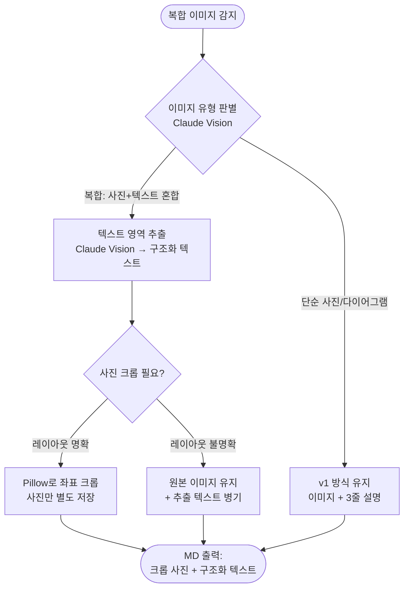

# PPTX → Markdown 변환기 개발 계획

---

## 아키텍처 & 흐름도


---

## 버전 현황

| 버전 | 상태 | 커밋 |
|------|------|------|
| v1 | ✅ 완료 (2026-06-29) | `3a0cd8d` |
| v2 | 🔨 진행 중 (Phase 1 완료) | — |

---

## 목표
PPTX 파일을 Markdown으로 변환. 이미지는 슬라이드 내 위치/순서를 보존하여 `images/` 하위 폴더에 저장, MD 내 상대경로로 참조.

## 실행 환경
- **Claude**: 데스크탑 앱 (API 키 없음, Claude Code 내에서 직접 실행)
- **Python**: python-pptx 기반 파싱 스크립트 (라이브러리 사용)
- **OS**: Windows 11 노트북

---

## 개발 단계

### Phase 1 — 파서 (prepare.py)
- [ ] PPTX 열기, 슬라이드 순회
- [ ] shape 좌표(left, top) 기준 위→아래, 좌→우 정렬
- [ ] 텍스트 shape → 내용 추출 (bold/italic 포함)
- [ ] 이미지 shape → PNG 저장 (`images/슬라이드번호_순번.png`)
- [ ] 슬라이드별 manifest JSON 생성

  ```json
  {
    "slide": 1,
    "elements": [
      { "type": "title", "text": "제목" },
      { "type": "text", "text": "본문 내용" },
      { "type": "image", "path": "images/01_01.png", "position": "center" }
    ]
  }
  ```

### Phase 2 — 학습 데이터 구성 (learn.py)
- [ ] 회사 PPTX 다수 분석
- [ ] 반복 레이아웃 패턴 추출 → `rules.json`
- [ ] 대표 슬라이드 변환 예시 수작업 작성 → `examples/` (Few-shot)

### Phase 3 — Claude 변환 (이 앱에서 실행)
- [ ] manifest + 이미지 파일을 Claude에 제공
- [ ] rules.json + examples/ Few-shot 포함한 프롬프트 구성
- [ ] 슬라이드별 MD 생성 → 하나의 파일로 병합
- [ ] 출력: `output/파일명.md` + `output/images/`

### Phase 4 — 정확도 개선 (반복)
- [ ] 변환 결과 검토
- [ ] 틀린 패턴 → rules.json 업데이트
- [ ] 새 Few-shot 예시 추가

---

## 출력 구조

```
output/
├── 파일명.md
└── images/
    ├── 01_01.png   ← 슬라이드1 첫번째 이미지
    ├── 01_02.png   ← 슬라이드1 두번째 이미지
    └── 02_01.png   ← 슬라이드2 첫번째 이미지
```

---

## 의존성

```
pip install python-pptx Pillow
```

외부 바이너리 없음 (LibreOffice 불필요)

---

## v1 완료 항목
- [x] Python 환경 확인 (Python 3.13, 전체 경로 필요)
- [x] 테스트용 샘플 PPTX 변환 완료
- [x] prepare.py 구현 (파싱, 이미지 추출, manifest.json)
- [x] Claude Vision 기반 한국어 MD 변환
- [x] 이미지 처리 규칙 확립 및 CLAUDE.md 반영
- [x] 의존성 체크 (--check 옵션)
- [x] v1 커밋 (3a0cd8d)

---

## v2 계획

### 배경
v1에서 확인된 한계: PPTX에 삽입된 **복합 이미지**(사진 + 텍스트가 하나의 이미지 파일로 합쳐진 경우)를 python-pptx가 단일 파일로만 추출함. 이미지 내 텍스트 정보가 MD에 반영되지 않음.

```
복합 이미지 예시 (02_01.png):
┌──────────┬─────────────────────────────┐
│  고양이   │  Prompt: How many cats...   │
│  사진    │  Groundtruth: (B)           │
│          │  MobileVLM-V2: 3 ❌         │
│          │  Ours: (B) 1. ✅            │
└──────────┴─────────────────────────────┘
```

### v2 목표: 복합 이미지 분리 처리



### Phase 1 — 복합 이미지 감지 및 텍스트 추출 ✅
- [x] Claude Vision으로 이미지 유형 자동 판별 (단순 / 복합) — rules.json 기준 정의
- [x] 복합 이미지 내 텍스트 전체 추출 → MD 본문 구조화 — CLAUDE.md 절차 문서화
- [x] 텍스트와 사진 영역 분리 설명 생성 — crop_spec.json 형식 정의

### Phase 2 — 사진 자동 크롭 (Pillow) ✅
- [x] Claude Vision이 사진 영역 좌표 추정 (x1, y1, x2, y2) — region_pct 비율 방식
- [x] Pillow로 해당 영역 크롭 → `images/슬라이드_순번_crop.png` 저장 — crop.py 구현
- [x] prepare.py: width_px, height_px 추가로 좌표 변환 기반 확보
- [ ] 크롭 정확도 검증 — 실제 PPTX 변환 후 검토 필요

### Phase 3 — 규칙 학습 (Few-shot 개선) ✅
- [x] 회사 PPTX 패턴 분석 → `rules.json` 구축 (v1.0 초안)
- [x] 복합 이미지 유형별 변환 예시 → `examples/` 폴더 구성 (3가지 유형)
- [ ] 반복 등장 레이아웃 자동 인식 — 추가 PPTX 샘플 필요

### Phase 4 — 품질 평가 체계
- [ ] 슬라이드별 변환 체크리스트 자동 생성
- [ ] 누락 요소 감지 (이미지 수, 텍스트 블록 수 비교)

---

### v2 판단 기준 (이미지 유형 분류)

| 유형 | 특징 | 처리 |
|------|------|------|
| 단순 사진 | 텍스트 없음, 자연 이미지 | 이미지 유지 + 설명 |
| 단순 다이어그램 | 도형/화살표, 텍스트 소량 | 이미지 유지 + 설명 |
| 복합 (텍스트 주도) | 텍스트 50% 이상 | 텍스트 추출 → 구조화 |
| 복합 (사진+텍스트) | 사진과 텍스트 병렬 | 크롭 + 텍스트 분리 |
| 수식/표 이미지 | 수식, 표 형태 | 구조화 텍스트 변환 |
